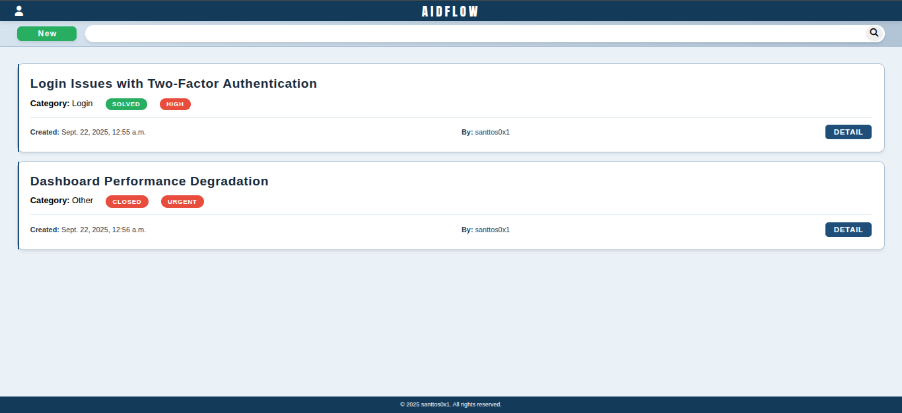
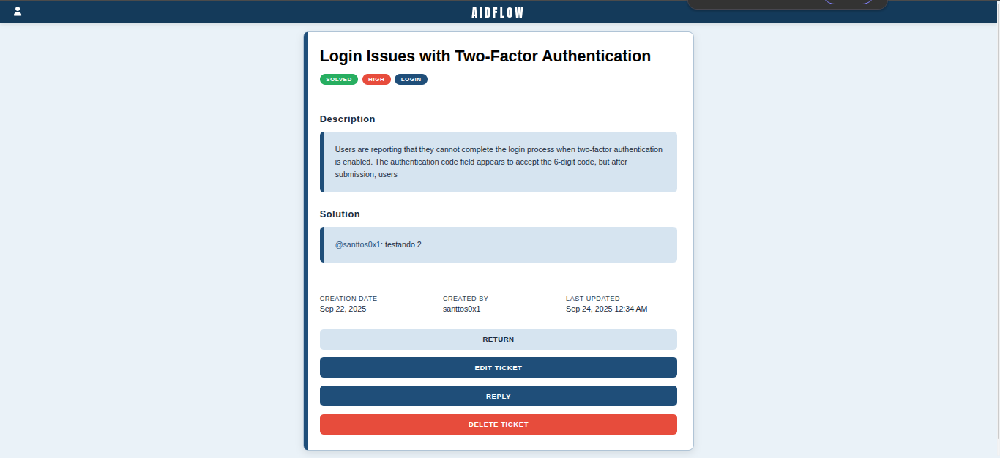

# AidFlow

A modern, responsive web application built with Django for efficient support ticket management. This system provides a clean interface for creating, tracking, and resolving customer support requests with role-based access control.



---

## Features

- **Ticket Management**: Create, view, edit, and track support tickets
- **User Authentication**: Secure login system with user management
- **Status Tracking**: Monitor ticket progress with visual status indicators
- **Priority System**: Organize tickets by priority levels (High, Medium, Low)
- **Category Organization**: Group tickets by categories for better organization
- **Responsive Design**: Mobile-first design that works on all devices
- **Clean UI**: Minimalist interface with professional styling

---



---

## Tech Stack

- **Backend**: Django 4.x
- **Database**: SQLite (development) / PostgreSQL (production ready)
- **Frontend**: HTML5, CSS3, JavaScript
- **Styling**: Custom CSS with CSS Grid and Flexbox
- **Icons**: Font Awesome 6
- **Fonts**: Anton SC (headers), Segoe UI (body text)

## Installation

### Prerequisites

- Python 3.8 or higher
- pip package manager
- Virtual environment (recommended)

### Setup

1.**Clone the repository**

```bash
git clone https://github.com/santtos0x1/aidflow.git
cd aidflow
```

2.**Create and activate virtual environment**

```bash
python -m venv venv

# On Windows
venv\Scripts\activate

# On macOS/Linux
source venv/bin/activate
```

3.**Install dependencies**

```bash
pip install -r requirements.txt
```

5.**Run database migrations**

```bash
python manage.py makemigrations
python manage.py migrate
```

6.**Create superuser**

```bash
python manage.py createsuperuser
```

7.**Collect static files (production)**

```bash
python manage.py collectstatic
```

8.**Run development server**

```bash
python manage.py runserver
```

The application will be available at `http://127.0.0.1:8000/`

## Models

### Ticket Model

- `uuid`: Unique identifier
- `title`: Ticket title
- `description`: Detailed description
- `category`: Ticket category (ForeignKey)
- `status`: Current status (ForeignKey)
- `priority`: Priority level (ForeignKey)
- `creation_date`: Auto-generated creation timestamp
- `created_by`: User who created the ticket (ForeignKey)
- `solution`: Ticket solution

### Supporting Models

- **Category**: Ticket categorization
- **Priority**: Priority levels (Urgent, High, Medium, Low)
- **Status**: Ticket status (Open, Closed, Pending)

## Usage

### Creating a Ticket

1. Navigate to the home page
2. Click the "New" button
3. Fill out the ticket form with required information
4. Submit to create the ticket

### Viewing Tickets

- Home page displays all user tickets in a card layout
- Each ticket shows title, category, status, priority, and creation info
- Click "Detail" button to view full ticket information

### Managing Tickets

- Edit tickets from the detail page
- Update status, priority, or other fields
- Track creation and modification dates

## API Endpoints

| Method | Endpoint | Description |
|--------|----------|-------------|
| GET | `/` | Get started page |
| GET | `/ticket/` | Home page with ticket list |
| POST | `/ticket/new/` | Create new ticket |
| POST | `/ticket/search` | List all searched tickets |
| GET | `/ticket/<uuid>/` | Ticket detail view |
| POST | `/ticket/<uuid>/edit/` | Update ticket |
| POST | `/ticket/<uuid>/reply/` | Reply a ticket |
| POST | `ticket/<uuid:uuid>/delete/` | Delete a ticket |

## Contributing

1. Fork the repository
2. Create a feature branch (`git checkout -b feature/new-feature`)
3. Commit your changes (`git commit -am 'Add new feature'`)
4. Push to the branch (`git push origin feature/new-feature`)
5. Create a Pull Request

## License

This project is licensed under the Apache 2.0 License - see the [LICENSE](LICENSE) file for details.
