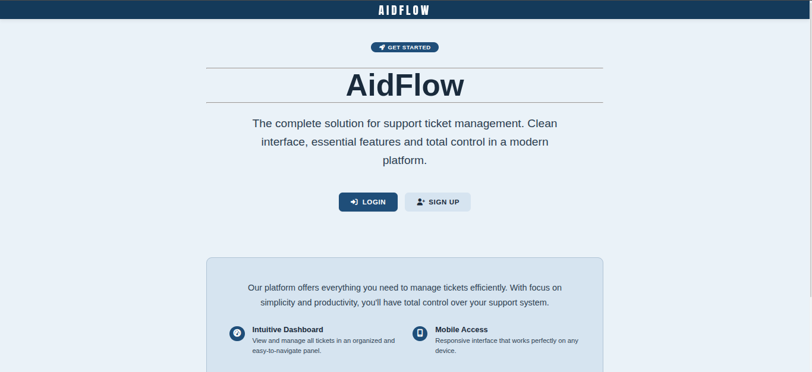

# AidFlow 🎫

> A modern, secure, and responsive support ticket management system built with Django

[](https://www.python.org/)
[](https://www.djangoproject.com/)
[](LICENSE)
[](https://github.com/santtos0x1/aidflow)

AidFlow is a professional-grade ticket management system designed for efficient customer support workflows. Built with security and user experience in mind, it provides a clean, intuitive interface for creating, tracking, and resolving support requests.



---

## ✨ Features

### Core Functionality
- 🎫 **Complete Ticket Lifecycle Management** - Create, view, edit, reply, and resolve tickets
- 👤 **User Authentication & Authorization** - Secure login system with role-based access
- 🔍 **Advanced Search** - Quickly find tickets by title or content
- 📊 **Status Tracking** - Visual indicators for ticket progress (Open, Pending, Closed)
- ⚡ **Priority System** - Organize by urgency (Urgent, High, Medium, Low)
- 🏷️ **Category Management** - Group tickets by department or issue type
- 💬 **Ticket Replies** - Threaded conversation system for ticket resolution

### Technical Highlights
- 🔒 **Security First** - CSRF protection, XSS prevention, SQL injection safeguards
- 📱 **Fully Responsive** - Mobile-first design that works on all devices
- 🧪 **99% Test Coverage** - 544 statements tested with comprehensive unit tests
- 🎨 **Clean UI/UX** - Minimalist interface with professional styling
- ⚡ **Performance Optimized** - Efficient database queries and caching


---

## 🛠️ Tech Stack

| Category | Technology |
|----------|-----------|
| **Backend** | Django 4.x, Python 3.8+ |
| **Database** | SQLite (dev), PostgreSQL (prod-ready) |
| **Frontend** | HTML5, CSS3 (Grid/Flexbox), Vanilla JavaScript |
| **Security** | Django Auth, CSRF Tokens, Password Hashing |
| **Testing** | Django TestCase, Coverage.py (99%) |
| **Icons** | Font Awesome 6 |
| **Typography** | Anton SC, Segoe UI |

---

## 🚀 Quick Start

### Prerequisites

- Python 3.8 or higher
- pip package manager
- Virtual environment (recommended)
- Git

### Installation

1. **Clone the repository**

```bash
git clone https://github.com/santtos0x1/aidflow.git
cd aidflow
```

2. **Create and activate virtual environment**

```bash
# Create venv
python -m venv venv

# Activate on Windows
venv\Scripts\activate

# Activate on macOS/Linux
source venv/bin/activate
```

3. **Install dependencies**

```bash
pip install -r requirements.txt
```

4. **Configure environment variables** (optional)

```bash
# Create .env file
cp .env.example .env

# Edit with your settings
SECRET_KEY=your-secret-key-here
DEBUG=True
DATABASE_URL=sqlite:///db.sqlite3
```

5. **Run database migrations**

```bash
python manage.py makemigrations
python manage.py migrate
```

6. **Create superuser (admin account)**

```bash
python manage.py createsuperuser
```

7. **Load initial data** (optional)

```bash
python manage.py loaddata initial_data.json
```

8. **Run development server**

```bash
python manage.py runserver
```

🎉 **Application is now running at:** `http://127.0.0.1:8000/`

---

## 📋 Usage Guide

### Creating Your First Ticket

1. Navigate to `/tickets/` or click "Get Started"
2. Click the **"New Ticket"** button
3. Fill in the form:
   - **Title**: Brief description of the issue
   - **Description**: Detailed explanation
   - **Category**: Select appropriate category
   - **Priority**: Choose urgency level
4. Click **"Register Ticket"**

### Managing Tickets

- **View All Tickets**: Home page displays all your tickets in card layout
- **Search Tickets**: Use the search bar to filter by title
- **View Details**: Click "Detail" button for full information
- **Edit Ticket**: Update status, priority, or add notes
- **Reply to Ticket**: Add responses or solutions
- **Delete Ticket**: Remove unwanted tickets (confirmation required)

### Admin Panel

Access the Django admin at `/admin/` to:
- Manage users and permissions
- Create categories and priorities
- View system-wide ticket statistics
- Moderate ticket content

---

## 🗂️ Database Models

### Ticket Model

```python
class Ticket(models.Model):
    uuid = UUIDField(primary_key=True)
    title = CharField(max_length=200)
    description = TextField()
    category = ForeignKey(Category)
    status = ForeignKey(Status)
    priority = ForeignKey(Priority)
    creation_date = DateTimeField(auto_now_add=True)
    updated_at = DateTimeField(auto_now=True)
    created_by = ForeignKey(User)
    solution = TextField(blank=True)
```

### Supporting Models

- **Category**: Categorize tickets (e.g., Technical, Billing, General)
- **Priority**: Urgency levels (Urgent, High, Medium, Low)
- **Status**: Ticket states (Open, Pending, Closed, Solved)

---

## 🔌 API Endpoints

| Method | Endpoint | Description | Auth Required |
|--------|----------|-------------|---------------|
| GET | `/` | Landing page | ❌ |
| GET | `/tickets/` | List all user tickets | ✅ |
| GET | `/tickets/new/` | Display ticket creation form | ✅ |
| POST | `/tickets/new/` | Create new ticket | ✅ |
| GET | `/tickets/search/?q=query` | Search tickets | ✅ |
| GET | `/tickets/<uuid>/` | View ticket details | ✅ |
| GET | `/tickets/<uuid>/edit/` | Display edit form | ✅ |
| POST | `/tickets/<uuid>/edit/` | Update ticket | ✅ |
| GET | `/tickets/<uuid>/reply/` | Display reply form | ✅ |
| POST | `/tickets/<uuid>/reply/` | Add reply to ticket | ✅ |
| POST | `/tickets/<uuid>/delete/` | Delete ticket | ✅ |

---

## 🧪 Testing

### Run Tests

```bash
# Run all tests
python manage.py test

# Run specific app tests
python manage.py test tickets

# Run with coverage report
coverage run --source='.' manage.py test
coverage report
coverage html  # Generate HTML report
```

### Test Coverage

- **Overall Coverage**: 99% (544/549 statements)
- **Models**: 97%
- **Views**: 100%
- **Forms**: 100%
- **URLs**: 100%

---

## 🔒 Security Features

- ✅ **CSRF Protection** - Token-based form validation
- ✅ **XSS Prevention** - Input sanitization and output escaping
- ✅ **SQL Injection** - Parameterized queries via Django ORM
- ✅ **Authentication** - Login required decorators on sensitive views

---

## 🤝 Contributing

Contributions are welcome! Please follow these steps:

1. **Fork** the repository
2. **Create** a feature branch
   ```bash
   git checkout -b feature/awesome-feature
   ```
3. **Commit** your changes
   ```bash
   git commit -m 'Add awesome feature'
   ```
4. **Push** to the branch
   ```bash
   git push origin feature/awesome-feature
   ```
5. **Open** a Pull Request

### Development Guidelines

- Write tests for new features (maintain 99% coverage)
- Follow PEP 8 style guidelines
- Update documentation for API changes
- Add type hints where applicable
- Keep commits atomic and well-described

---

## 📝 License

This project is licensed under the **Apache License 2.0** - see the [LICENSE](LICENSE) file for details.

---

## 👨‍💻 Author

**Santos0x1**
- GitHub: [@santtos0x1](https://github.com/santtos0x1)

---

## 🙏 Acknowledgments

- Django Software Foundation for the amazing framework
- Font Awesome for the icon library
- The open-source community for inspiration and tools

---

## 📊 Project Status

- ✅ Core Features Complete
- ✅ 99% Test Coverage
- 🚧 User Authentication (In Progress)

---

<div align="center">

**⭐ If you found this project useful, please consider giving it a star! ⭐**

Made with ❤️ using Django

</div>